# Open RL Benchmark: Comprehensive Tracked Experiments for Reinforcement Learning


[](https://github.com/vwxyzjn/cleanrl)
[](https://github.com/psf/black)
[](https://pycqa.github.io/isort/)
[](https://colab.research.google.com/github/openrlbenchmark/openrlbenchmark/blob/master/README.ipynb)
[](https://discord.gg/GsmqhDcea5)


Open RL Benchmark is a comprehensive collection of tracked experiments for RL. It aims to make it easier for RL practitioners to pull and compare all kinds of metrics from reputable RL libraries like Stable-baselines3, Tianshou, CleanRL, and others.

* 💾 [GitHub Repo](https://github.com/openrlbenchmark/openrlbenchmark): source code and more docs.
* 📜 [Design docs](https://docs.google.com/document/d/1cDI_AMr2QVmkC53dCHFMYwGJtLC8V4p6KdL2wnYPaiI/edit?usp=sharing): our motivation and vision.
* 🔗 [Open RL Benchmark reports](https://wandb.ai/openrlbenchmark/openrlbenchmark/reportlist):  W&B reports with tracked Atari, MuJoCo experiments from SB3, CleanRL, and others.


## Installation
You can install it via pip or the dev setup.

### Pip install

```shell
pip install openrlbenchmark --upgrade
```

### Dev Setup

Prerequisites:
* Python >=3.7.1,<3.10 (not yet 3.10)
* [Poetry 1.2.1+](https://python-poetry.org)

```shell
git clone https://github.com/openrlbenchmark/openrlbenchmark.git
cd openrlbenchmark
poetry install
```


## Get started

Open RL Benchmark provides an RLops CLI to pull and compare metrics from Weights and Biases. The following example shows how to compare the performance of SB3's ppo, a2c, ddpg, ppo_lstm, sac, td3, ppo, trpo, CleanRL's sac on `HalfCheetahBulletEnv-v0`.

```shell
python -m openrlbenchmark.rlops \
    --filters '?we=openrlbenchmark&wpn=cleanrl&ceik=env_id&cen=exp_name&metric=charts/episodic_return' \
        'ppo_continuous_action?tag=v1.0.0-27-gde3f410&cl=CleanRL PPO' \
    --filters '?we=openrlbenchmark&wpn=baselines&ceik=env&cen=exp_name&metric=charts/episodic_return' \
        'baselines-ppo2-mlp?cl=openai/baselines PPO2' \
    --env-ids HalfCheetah-v2 Hopper-v2 Walker2d-v2 \
    --env-ids HalfCheetah-v2 Hopper-v2 Walker2d-v2 \
    --no-check-empty-runs \
    --pc.ncols 3 \
    --pc.ncols-legend 3 \
    --rliable \
    --rc.score_normalization_method maxmin \
    --rc.normalized_score_threshold 1.0 \
    --rc.sample_efficiency_plots \
    --rc.sample_efficiency_and_walltime_efficiency_method Median \
    --rc.performance_profile_plots  \
    --rc.aggregate_metrics_plots  \
    --rc.sample_efficiency_num_bootstrap_reps 10 \
    --rc.performance_profile_num_bootstrap_reps 10 \
    --rc.interval_estimates_num_bootstrap_reps 10 \
    --output-filename compare \
    --scan-history
```

Here, we created multiple filters. The first string in the first filter is `'?we=openrlbenchmark&wpn=baselines&ceik=env&cen=exp_name&metric=charts/episodic_return'`, which is a query string that specifies the following:

* `we`: the W&B entity name
* `wpn`: the W&B project name
* `ceik`: the custom key for the environment id
* `cen`: the custom key for the experiment name
* `metric`: the metric we are interested in

So we are fetching metrics from [https://wandb.ai/openrlbenchmark/baselines](https://wandb.ai/openrlbenchmark/baselines). The environment id is stored in the `env` key, and the experiment name is stored in the `exp_name` key. The metric we are interested in is `charts/episodic_return`.

Similarly, we are fetching metrics from [https://wandb.ai/openrlbenchmark/cleanrl](https://wandb.ai/openrlbenchmark/cleanrl). The environment id is stored in the `env_id` key, and the experiment name is stored in the `exp_name` key. The metric we are interested in is `charts/episodic_return`. You can also customize the legend with the `cl` query string, such as `baselines-ppo2-mlp?cl=openai/baselines PPO2`.

The labels of the figure can be customized with the `--pc.xlabel` and `--pc.ylabel` flags. You can also specify the maximum number of timesteps to plot with `--pc.max_steps`. The `--pc.ncols` flag specifies the number of columns in the figure. The `--pc.ncols-legend` flag specifies the number of columns in the legend. The `--output-filename` flag specifies the filename of the output figure

The `--rliable` toggles our [rliable](https://github.com/google-research/rliable) integration, and its configuration can be tweeked via `--rc`. The command above generates the following plot:

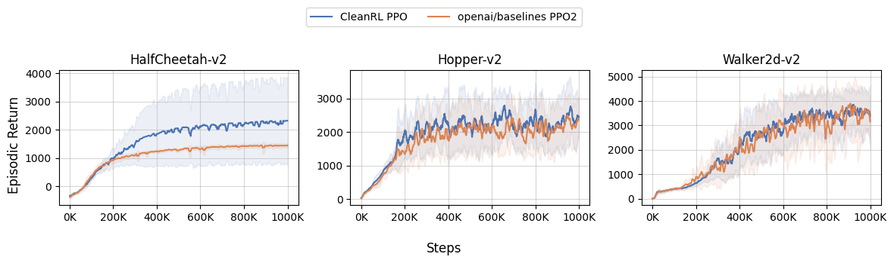
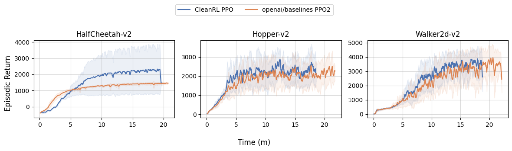
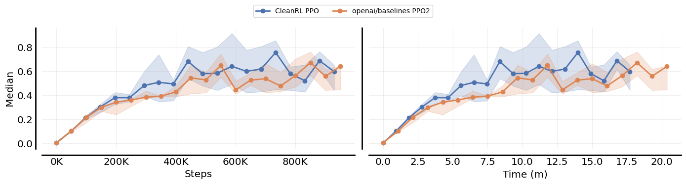
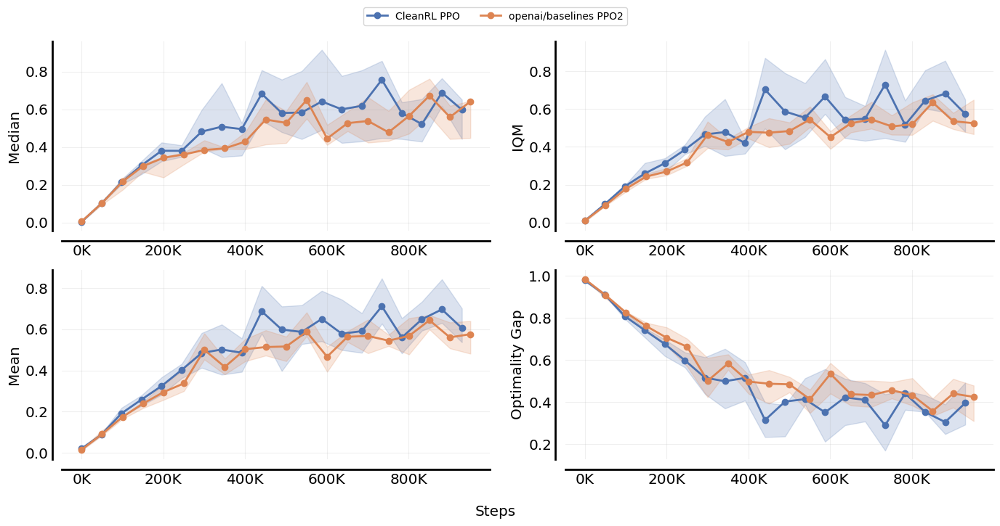
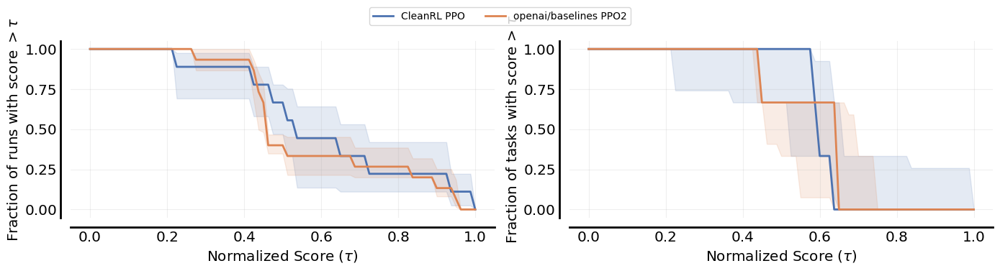
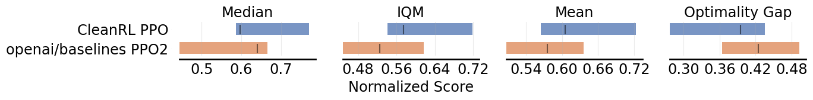


The `--report` tag also generates a [wandb report](https://wandb.ai/costa-huang/cleanrl/reports/Regression-Report-openai-baselines-PPO2--Vmlldzo0NTU4MTE5)


The command also generates a `compare.png`, a `compare.md`, and a `compare.csv` in the current directory.

**Learning curves:** the `compare.png` shows the learning curves which subsamples 10000 data points and and interpolate. The curves are smoothed by a rolling average with a window size 100 and their shaded region represents the standard deviation.

**Result table:** the `compare.md` and `compare.csv` shows the average episodic return of the last 100 episodes. For each random seed $i$ (we have 3 random seeds for each set of experiments), we calculate the average episodic return of the last 100 training episodes as $a_i$. We then average the $a_i$'s over all random seeds to get the final average episodic return and report its standard deviation. This type of evaluation is known as an implicit evaluation method ([Machado et al., 2017](https://arxiv.org/pdf/1709.06009.pdf)) which aligns better with the general goal of RL which is continual learning. This method also detects issues with catastrophic forgetting compared to the evaluation method that evaluates the best model.


> **Warning**
> We recommend you to use `--scan-history` which pullts all of the data points, but initially it will cache the data and may take a while to run. If you don't use `--scan-history`, it will only pull 500 data points from wandb randomly, which could generate different learning curves each time you run the command.


## Offline mode

We introduced an experimental **offline** mode. Sometimes even with caching `--scan-history` the script can still take a long time if there are too many environments or experiments. This is because we are still calling many `wandb.Api().runs(..., filters)` under the hood. 

No worries though. When running with `--scan-history`, we also automatically build a local `sqlite` database to store the metadata of runs. Then, you can run `python -m openrlbenchmark.rlops ... --scan-history --offline` to generate the plots without having access to the internet. It should considerably speed up the plotting process as well. We are still working on improving the offline mode, so please let us know if you encounter any issues. 


## Currently supported libraries

* [CleanRL](https://wandb.ai/openrlbenchmark/cleanrl)
    * `ceik`: `env_id`
    * `cen`: `exp_name` (e.g., `sac_continuous_action`, `ppo_continuous_action`, `ppo_atari`)
    * `metric`: `charts/episodic_return`
* [Stable-baselines3](https://wandb.ai/openrlbenchmark/sb3)
    * `ceik`: `env`
    * `cen`: `algo` (e.g., `sac`, `ppo`, `a2c`)
    * `metric`: `rollout/ep_rew_mean` or `eval/mean_reward`
* [ikostrikov/jaxrl](https://wandb.ai/openrlbenchmark/jaxrl)
    * `ceik`: `env_name`
    * `cen`: `algo` (e.g., `sac`)
    * `metric`: `training/return` or `evaluation/average_returns`
* [baselines](https://wandb.ai/openrlbenchmark/baselines)
    * `ceik`: `env`
    * `cen`: `alg` (e.g., `ppo2`)
    * `metric`: `charts/episodic_return` or `eprewmean`
* [sbx](https://wandb.ai/openrlbenchmark/sbx)
    * `ceik`: `env`
    * `cen`: `alg` (e.g., `sac`, `tqc`)
    * `metric`: `rollout/ep_rew_mean` or `eval/mean_reward`
* [Tianshou](https://wandb.ai/tianshou/atari.benchmark)
    * `ceik`: `task`
    * `cen`: `algo_name` (e.g., `ppo`, `iqn`)
    * `metric`: `test/reward`
* [MORL-Baselines](https://wandb.ai/openrlbenchmark/morl-baselines)
    * `ceik`: `env_id`
    * `cen`: `algo` (e.g., `PGMORL`, `PCN`)
    * `metric`: `eval/hypervolume`, `eval/igd`, `eval/sparsity`, `eval/eum`, `eval/mul`

The following libraries have some recorded experiments:

* [openai/phasic-policy-gradient](https://wandb.ai/openrlbenchmark/phasic-policy-gradient) (has some metrics)
    * `ceik`: `env_name`
    * `cen`: `arch` (`shared`)
    * `metric`: `charts/episodic_return`
* [sfujim/TD3](https://wandb.ai/openrlbenchmark/sfujim-TD3) (has some metrics)
    * `ceik`: `env`
    * `cen`: `policy` (e.g., `TD3`)
    * `metric`: `charts/episodic_return`


## More examples

### Compare CleanRL's PPO with `openai/baselines`'s PPO2 on Atari games:

Sometimes the same environments could have different names in different libraries. For example, `openai/baselines` uses `BreakoutNoFrameskip-v4` while [EnvPool](https://envpool.readthedocs.io/en/latest/env/atari.html) uses `Breakout-v5`. To compare the two libraries, we need to specify the `env_id` for `CleanRL` and `env` for `openai/baselines`. In this case, can specify the corresponding `env_ids` for each filter.

For Atari games, we can toggle `--rc.score_normalization_method atari` option to use human-normalized scores for `rliable` analysis.


```shell
python -m openrlbenchmark.rlops \
    --filters '?we=openrlbenchmark&wpn=baselines&ceik=env&cen=exp_name&metric=charts/episodic_return' 'baselines-ppo2-cnn' \
    --filters '?we=openrlbenchmark&wpn=envpool-atari&ceik=env_id&cen=exp_name&metric=charts/avg_episodic_return' 'ppo_atari_envpool_xla_jax_truncation' \
    --env-ids AlienNoFrameskip-v4 AmidarNoFrameskip-v4 AssaultNoFrameskip-v4 AsterixNoFrameskip-v4 AsteroidsNoFrameskip-v4 AtlantisNoFrameskip-v4 BankHeistNoFrameskip-v4 BattleZoneNoFrameskip-v4 BeamRiderNoFrameskip-v4 BerzerkNoFrameskip-v4 BowlingNoFrameskip-v4 BoxingNoFrameskip-v4 BreakoutNoFrameskip-v4 CentipedeNoFrameskip-v4 ChopperCommandNoFrameskip-v4 CrazyClimberNoFrameskip-v4 DefenderNoFrameskip-v4 DemonAttackNoFrameskip-v4 DoubleDunkNoFrameskip-v4 EnduroNoFrameskip-v4 FishingDerbyNoFrameskip-v4 FreewayNoFrameskip-v4 FrostbiteNoFrameskip-v4 GopherNoFrameskip-v4 GravitarNoFrameskip-v4 HeroNoFrameskip-v4 IceHockeyNoFrameskip-v4 PrivateEyeNoFrameskip-v4 QbertNoFrameskip-v4 RiverraidNoFrameskip-v4 RoadRunnerNoFrameskip-v4 RobotankNoFrameskip-v4 SeaquestNoFrameskip-v4 SkiingNoFrameskip-v4 SolarisNoFrameskip-v4 SpaceInvadersNoFrameskip-v4 StarGunnerNoFrameskip-v4 SurroundNoFrameskip-v4 TennisNoFrameskip-v4 TimePilotNoFrameskip-v4 TutankhamNoFrameskip-v4 UpNDownNoFrameskip-v4 VentureNoFrameskip-v4 VideoPinballNoFrameskip-v4 WizardOfWorNoFrameskip-v4 YarsRevengeNoFrameskip-v4 ZaxxonNoFrameskip-v4 JamesbondNoFrameskip-v4 KangarooNoFrameskip-v4 KrullNoFrameskip-v4 KungFuMasterNoFrameskip-v4 MontezumaRevengeNoFrameskip-v4 MsPacmanNoFrameskip-v4 NameThisGameNoFrameskip-v4 PhoenixNoFrameskip-v4 PitfallNoFrameskip-v4 PongNoFrameskip-v4 \
    --env-ids Alien-v5 Amidar-v5 Assault-v5 Asterix-v5 Asteroids-v5 Atlantis-v5 BankHeist-v5 BattleZone-v5 BeamRider-v5 Berzerk-v5 Bowling-v5 Boxing-v5 Breakout-v5 Centipede-v5 ChopperCommand-v5 CrazyClimber-v5 Defender-v5 DemonAttack-v5 DoubleDunk-v5 Enduro-v5 FishingDerby-v5 Freeway-v5 Frostbite-v5 Gopher-v5 Gravitar-v5 Hero-v5 IceHockey-v5 PrivateEye-v5 Qbert-v5 Riverraid-v5 RoadRunner-v5 Robotank-v5 Seaquest-v5 Skiing-v5 Solaris-v5 SpaceInvaders-v5 StarGunner-v5 Surround-v5 Tennis-v5 TimePilot-v5 Tutankham-v5 UpNDown-v5 Venture-v5 VideoPinball-v5 WizardOfWor-v5 YarsRevenge-v5 Zaxxon-v5 Jamesbond-v5 Kangaroo-v5 Krull-v5 KungFuMaster-v5 MontezumaRevenge-v5 MsPacman-v5 NameThisGame-v5 Phoenix-v5 Pitfall-v5 Pong-v5 \
    --no-check-empty-runs \
    --pc.ncols 5 \
    --pc.ncols-legend 2 \
    --rliable \
    --rc.score_normalization_method atari \
    --rc.normalized_score_threshold 8.0 \
    --rc.sample_efficiency_plots \
    --rc.sample_efficiency_and_walltime_efficiency_method Median \
    --rc.performance_profile_plots  \
    --rc.aggregate_metrics_plots  \
    --rc.sample_efficiency_num_bootstrap_reps 50000 \
    --rc.performance_profile_num_bootstrap_reps 2000 \
    --rc.interval_estimates_num_bootstrap_reps 2000 \
    --output-filename static/cleanrl_vs_baselines_atari \
    --scan-history
```


Furthermore, the `--rliable` integration generates `cleanrl_vs_baselines_iqm_profile.png`, the  Interquartile Mean (IQM) and performance profile ([Agarwal et al., 2022](https://arxiv.org/pdf/2108.13264.pdf)), and `cleanrl_vs_baselines_hns_aggregate.png`, the aggregate human-normalized scores with Stratified Bootstrap Confidence Intervals (see @araffin's excellent blog post [explainer](https://araffin.github.io/post/rliable/)). 


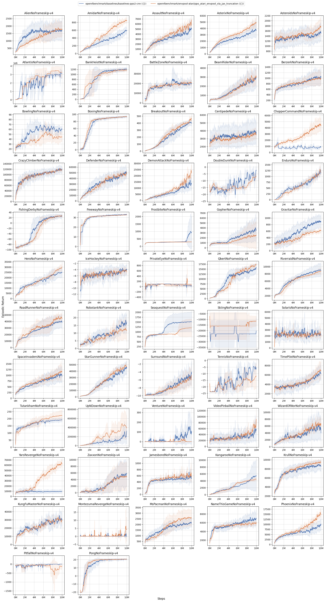
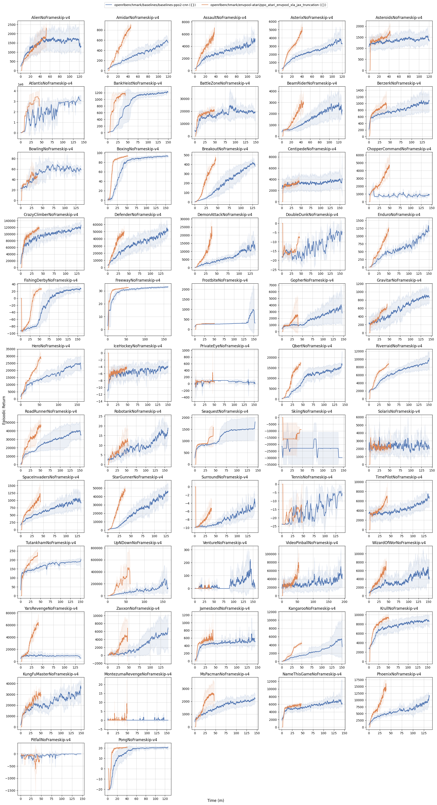
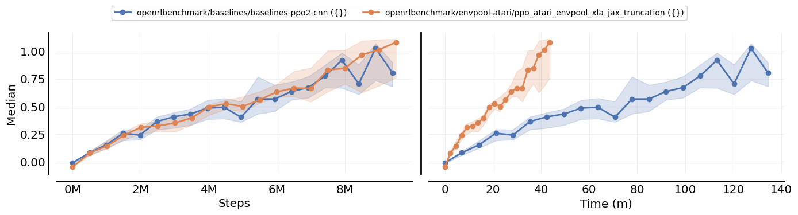
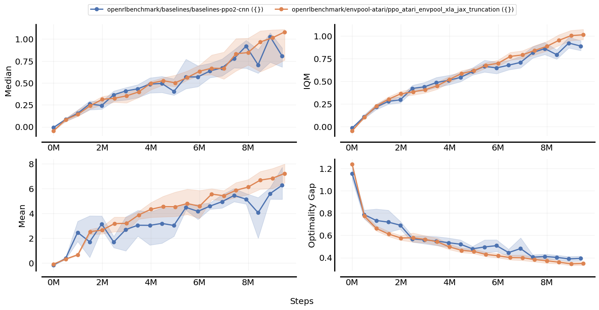
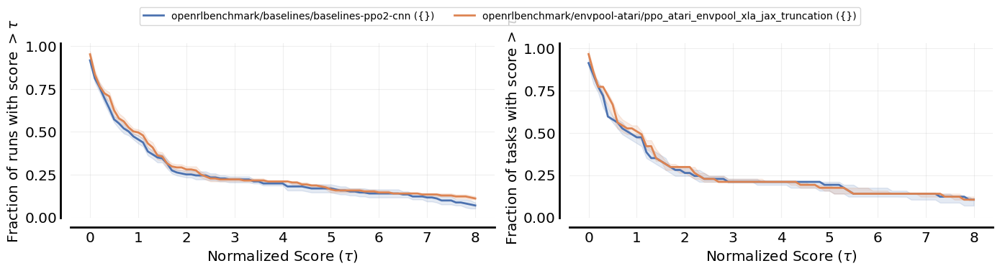
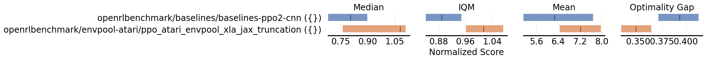


### Compare CleanRL's PPO with `openai/baselines`'s PPO2 and `jaxrl`'s SAC on Mujoco:

```shell
python -m openrlbenchmark.rlops \
    --filters '?we=openrlbenchmark&wpn=baselines&ceik=env&cen=exp_name&metric=charts/episodic_return' 'baselines-ppo2-mlp' \
    --filters '?we=openrlbenchmark&wpn=cleanrl&ceik=env_id&cen=exp_name&metric=charts/episodic_return' 'ppo_continuous_action?tag=v1.0.0-27-gde3f410' \
    --filters '?we=openrlbenchmark&wpn=jaxrl&ceik=env_name&cen=algo&metric=training/return' 'sac' \
    --env-ids HalfCheetah-v2 Walker2d-v2 Hopper-v2 InvertedPendulum-v2 Humanoid-v2 Pusher-v2 \
    --no-check-empty-runs \
    --pc.ncols 3 \
    --pc.ncols-legend 3 \
    --output-filename static/baselines_vs_cleanrl_vs_jaxrl \
    --scan-history
```
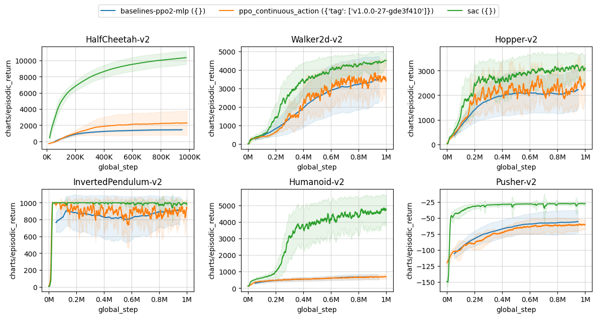


### Multi-metrics

**Experimental! API may change.**

Sometimes you want to compare multiple metrics at once.

```shell
python -m openrlbenchmark.rlops_multi_metrics \
    --filters '?we=openrlbenchmark&wpn=cleanrl&ceik=env_id&cen=exp_name&metrics=charts/episodic_return&metrics=charts/episodic_length&metrics=charts/SPS&metrics=losses/actor_loss&metrics=losses/qf1_values&metrics=losses/qf1_loss' \
        'ddpg_continuous_action?tag=pr-371' \
        'ddpg_continuous_action?tag=pr-299' \
        'ddpg_continuous_action?tag=rlops-pilot' \
        'ddpg_continuous_action_jax?tag=pr-371-jax' \
        'ddpg_continuous_action_jax?tag=pr-298' \
    --env-ids HalfCheetah-v2 Hopper-v2 Walker2d-v2 \
    --no-check-empty-runs \
    --pc.ncols 3 \
    --pc.ncols-legend 2 \
    --output-filename static/multi-metrics \
    --scan-history --offline
```
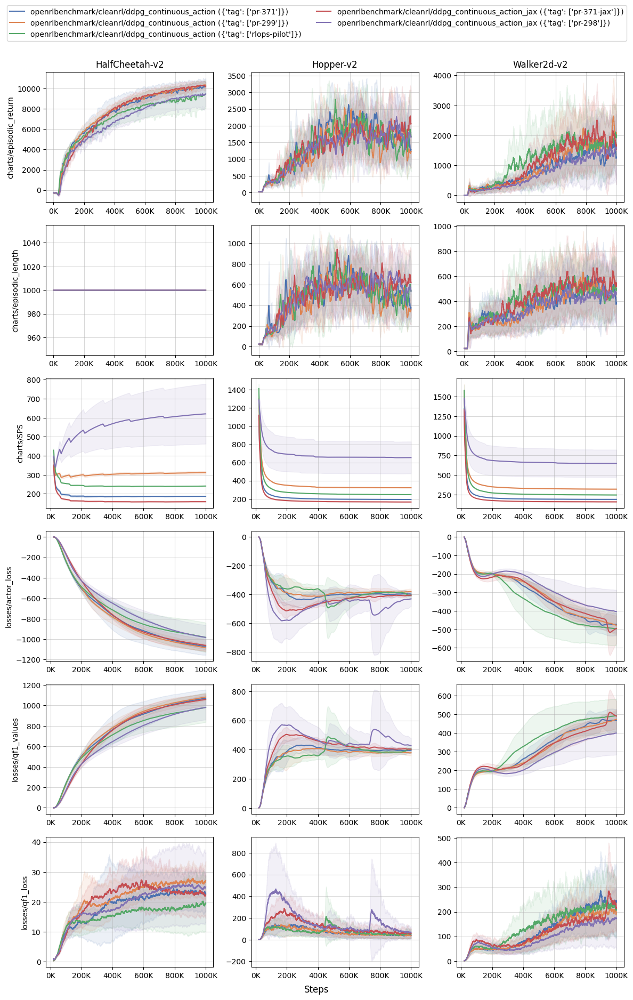


### Compare Tianshou's algorithms with `openai/baselines`'s PPO2 on Atari:

```shell
python -m openrlbenchmark.rlops \
    --filters '?we=tianshou&wpn=atari.benchmark&ceik=task&cen=algo_name&metric=test/reward' 'iqn' 'ppo' 'rainbow' 'fqf' 'c51' 'dqn' 'qrdqn' \
    --filters '?we=openrlbenchmark&wpn=baselines&ceik=env&cen=exp_name&metric=charts/episodic_return' 'baselines-ppo2-cnn' \
    --env-ids BreakoutNoFrameskip-v4 SpaceInvadersNoFrameskip-v4 SeaquestNoFrameskip-v4 MsPacmanNoFrameskip-v4 EnduroNoFrameskip-v4 PongNoFrameskip-v4 QbertNoFrameskip-v4 \
    --no-check-empty-runs \
    --pc.ncols 4 \
    --pc.ncols-legend 4 \
    --output-filename static/baselines_vs_tianshou --scan-history
```
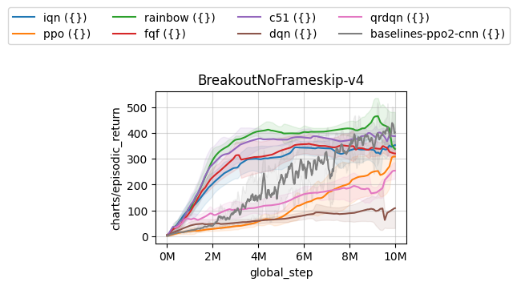


### Compare CleanRL's PPG and PPO with `openai/phasic-policy-gradient`'s PPG on procgen:

```shell
python -m openrlbenchmark.rlops \
    --filters '?we=openrlbenchmark&wpn=phasic-policy-gradient&ceik=env_name&cen=arch&metric=charts/episodic_return' 'shared' \
    --filters '?we=openrlbenchmark&wpn=cleanrl&ceik=env_id&cen=exp_name&metric=charts/episodic_return' 'ppo_procgen?tag=v1.0.0b1-4-g4ea73d9' 'ppg_procgen?tag=v1.0.0b1-4-g4ea73d9' \
    --env-ids starpilot bossfight bigfish \
    --no-check-empty-runs \
    --pc.ncols 3 \
    --pc.ncols-legend 3 \
    --output-filename static/ppg_vs_cleanrl \
    --scan-history
```

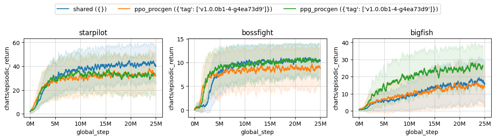


### Compare CleanRL's TD3 with `sfujim/TD3`'s TD3 on Mujoco:

```shell
python -m openrlbenchmark.rlops \
    --filters '?we=openrlbenchmark&wpn=sfujim-TD3&ceik=env&cen=policy&metric=charts/episodic_return' 'TD3' \
    --filters '?we=openrlbenchmark&wpn=cleanrl&ceik=env_id&cen=exp_name&metric=charts/episodic_return' 'td3_continuous_action_jax?tag=pr-285' 'ddpg_continuous_action_jax?tag=pr-298' \
    --env-ids HalfCheetah-v2 Walker2d-v2 Hopper-v2 \
    --no-check-empty-runs \
    --pc.ncols 3 \
    --pc.ncols-legend 3 \
    --output-filename static/td3_vs_cleanrl \
    --scan-history
```
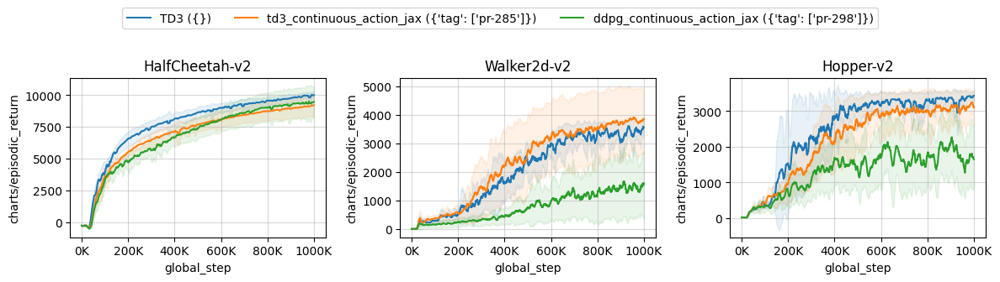


### Compare MORL Baselines algorithms
Notice the number of timesteps is adjusted using `--pc.max_steps 400000`.

```shell
python -m openrlbenchmark.rlops_multi_metrics \
  --filters '?we=openrlbenchmark&wpn=MORL-Baselines&ceik=env_id&cen=algo&metrics=eval/hypervolume&metrics=eval/sparsity&metrics=eval/eum' \
  'PGMORL?cl=PGMORL' \
  'CAPQL?cl=CAPQL' \
  'GPI-LS Continuous Action?cl=GPI-LS' \
  'GPI-PD Continuous Action?cl=GPI-PD' \
  --env-ids mo-halfcheetah-v4 mo-hopper-2d-v4  \
  --pc.ncols 2 \
  --pc.ncols-legend 4 \
  --pc.xlabel 'Training steps' \
  --pc.ylabel '' \
  --pc.max_steps 400000 \
  --output-filename morl/morl_continuous \
  --scan-history
```

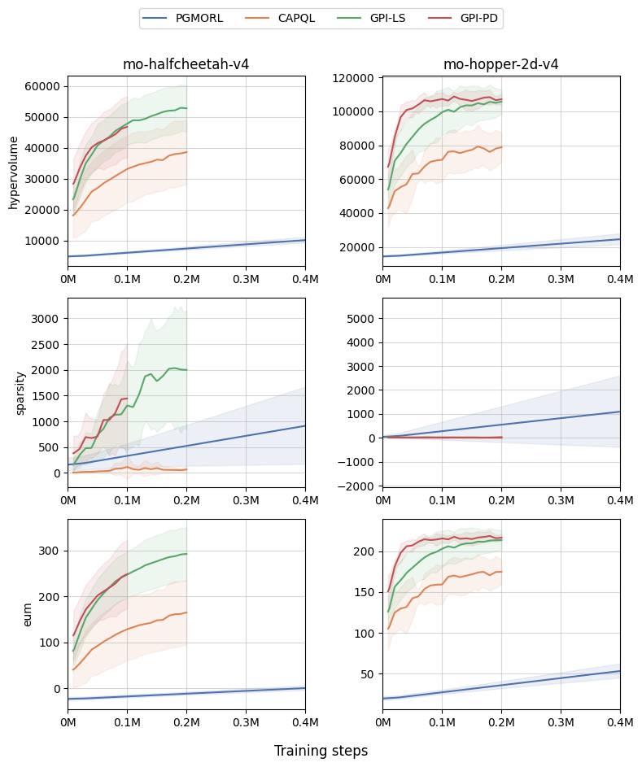
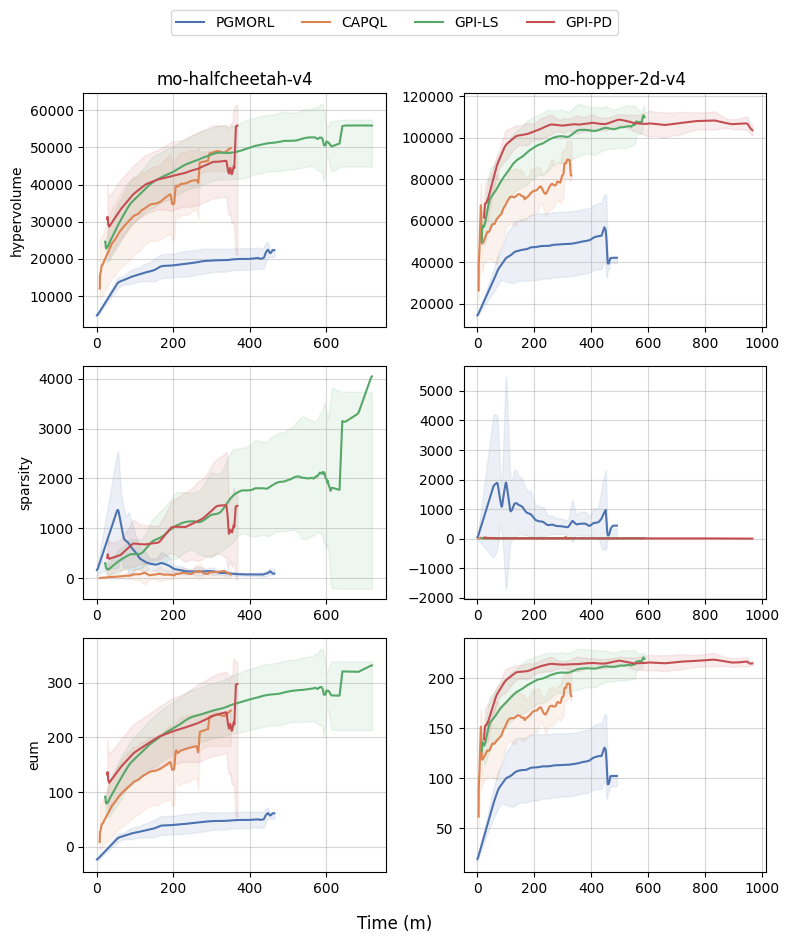

### Calculate human normalized scores

```shell
python -m openrlbenchmark.hns --files static/cleanrl_vs_baselines.csv static/machado_10M.csv static/machado_50M.csv 
```

```
baselines-ppo2-cnn ({})
┣━━ median hns: 0.7959851540635047
┣━━ mean hns: 4.54588939893709
ppo_atari_envpool_xla_jax_truncation ({})
┣━━ median hns: 0.9783505154639175
┣━━ mean hns: 6.841083973256849
ppo_atari_envpool_xla_jax_truncation_machado_10M ({})
┣━━ median hns: 0.7347972972972973
┣━━ mean hns: 2.919095857954249
ppo_atari_envpool_xla_jax_truncation ({'metric': ['charts/avg_episodic_return']})
┣━━ median hns: 0.9783505154639175
┣━━ mean hns: 6.841083973256849
ppo_atari_envpool_xla_jax_truncation_machado ({'metric': ['charts/avg_episodic_return']})
┣━━ median hns: 1.5679929625118418
┣━━ mean hns: 8.352308370550299
```

## What's going on right now?

This is a project we are slowly working on. There is no specific timeline or roadmap, but if you want to get involved. Feel free to reach out to me or open an issue. We are looking for volunteers to help us with the following:

* Add experiments from other libraries
* Run more experiments from currently supported libraries
* Documentation and designing standards
* Download the tensorboard metrics from the tracked experiments and load them locally to save time

## Citation

If you have used this software in your work, please use the following citation.

```bibtex
@software{
    Huang_openrlbenchmark_2023,
    author = {Huang, Shengyi and Gallouédec, Quentin and Felten, Florian and Raffin, Antonin and Dossa, Rousslan Fernand Julien and Zhao, Yanxiao and Sullivan, Ryan and Makoviychuk, Viktor and Makoviichuk, Denys and Roumégous, Cyril and Weng, Jiayi and Chen, Chufan and Rahman, Masudur and M. Araújo, João G. and Quan, Guorui and Tan, Daniel and Klein, Timo and Charakorn, Rujikorn and Towers, Mark and Berthelot, Yann and Mehta, Kinal and Chakraborty, Dipam and KG, Arjun and Charraut, Valentin and Ye, Chang and Liu, Zichen and Alegre, Lucas N. and Choi, Jongwook and Yi, Brent},
    month = may,
    title = {{openrlbenchmark}},
    url = {https://github.com/openrlbenchmark/openrlbenchmark},
    year = {2023}
}
```
