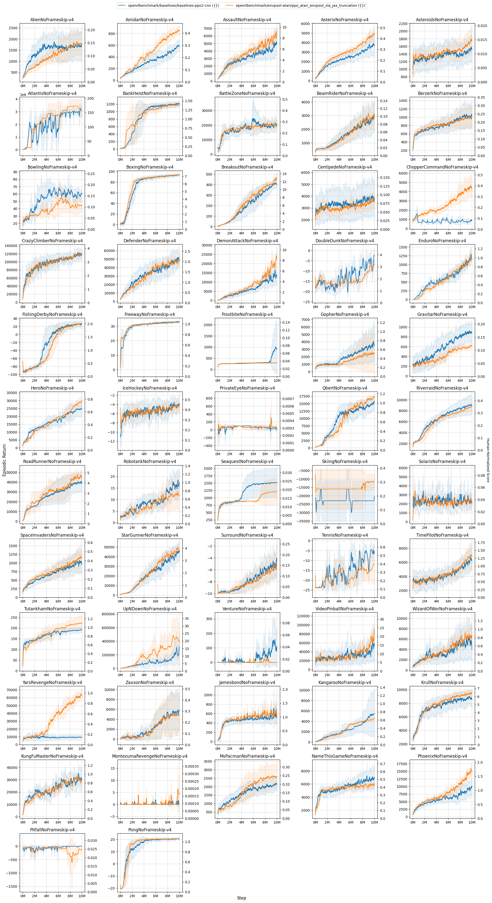
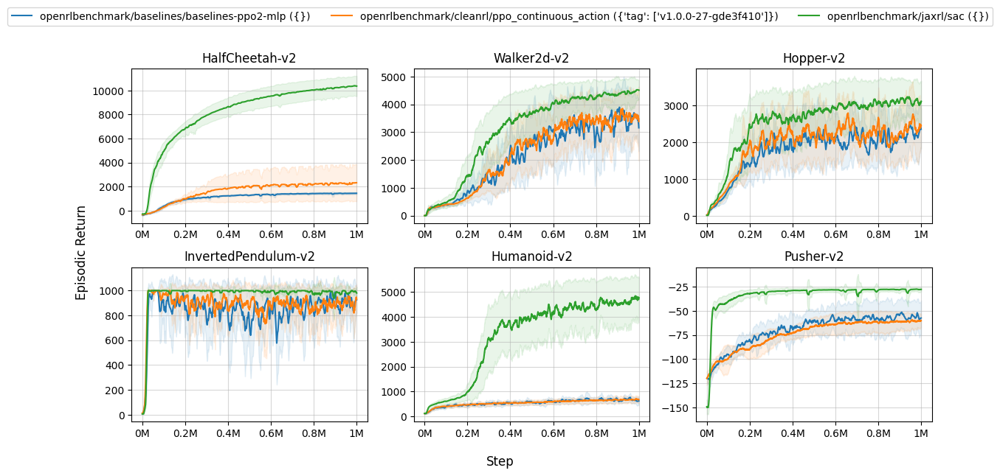
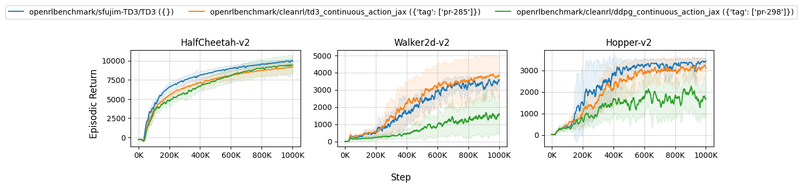

# Open RL Benchmark: Comprehensive Tracked Experiments for Reinforcement Learning


[](https://github.com/vwxyzjn/cleanrl)
[](https://github.com/psf/black)
[](https://pycqa.github.io/isort/)
[](https://colab.research.google.com/github/openrlbenchmark/openrlbenchmark/blob/master/README.ipynb)


Open RL Benchmark is a comprehensive collection of tracked experiments for RL. It aims to make it easier for RL practitioners to pull and compare all kinds of metrics from reputable RL libraries like Stable-baselines3, Tianshou, CleanRL, and others.

* 💾 [GitHub Repo](https://github.com/openrlbenchmark/openrlbenchmark): source code and more docs.
* 📜 [Design docs](https://docs.google.com/document/d/1cDI_AMr2QVmkC53dCHFMYwGJtLC8V4p6KdL2wnYPaiI/edit?usp=sharing): our motivation and vision.
* 🔗 [Open RL Benchmark reports](https://wandb.ai/openrlbenchmark/openrlbenchmark/reportlist):  W&B reports with tracked Atari, MuJoCo experiments from SB3, CleanRL, and others.

> ⚠️ This is the `0.1.1a4` alpha release. There has been a major refactoring. If you are looking for Pre-Alpha API, check out [43fc8e2](https://github.com/openrlbenchmark/openrlbenchmark/tree/43fc8e2066ac6371913ac53b629928ac15a65e13). Expect breaking changes in the future.


## Installation
You can install it via pip or the dev setup.

### Pip install
`pip install openrlbenchmark`

### Dev Setup

Prerequisites:
* Python >=3.7.1,<3.10 (not yet 3.10)
* [Poetry 1.2.1+](https://python-poetry.org)

```
git clone https://github.com/openrlbenchmark/openrlbenchmark.git
cd openrlbenchmark
poetry install
```


## Get started

Open RL Benchmark provides an RLops CLI to pull and compare metrics from Weights and Biases. The following example shows how to compare the performance of SB3's ppo, a2c, ddpg, ppo_lstm, sac, td3, ppo, trpo, CleanRL's sac on `HalfCheetahBulletEnv-v0`.

```
python -m openrlbenchmark.rlops \
    --filters '?we=openrlbenchmark&wpn=sb3&ceik=env&cen=algo&metric=rollout/ep_rew_mean' \
        'a2c' \
        'ddpg' \
        'ppo_lstm' \
        'sac' \
        'td3' \
        'ppo' \
        'trpo' \
    --filters '?we=openrlbenchmark&wpn=cleanrl&ceik=env_id&cen=exp_name&metric=charts/episodic_return' \
        'sac_continuous_action?tag=rlops-pilot' \
    --env-ids HalfCheetahBulletEnv-v0 \
    --ncols 1 \
    --ncols-legend 2 \
    --output-filename compare.png \
    --report
```

Here, we use create multiple filters. The first string in the first filter is `'?we=openrlbenchmark&wpn=sb3&ceik=env&cen=algo&metric=rollout/ep_rew_mean'`, which is a query string that specifies the following:

* `we`: the W&B entity name
* `wpn`: the W&B project name
* `ceik`: the custom key for the environment id
* `cen`: the custom key for the experiment name
* `metric`: the metric we are interested in

So we are fetching metrics from [https://wandb.ai/openrlbenchmark/sb3](https://wandb.ai/openrlbenchmark/sb3). The environment id is stored in the `env` key, and the experiment name is stored in the `algo` key. The metric we are interested in is `rollout/ep_rew_mean`.

Similarly, we are fetching metrics from [https://wandb.ai/openrlbenchmark/cleanrl](https://wandb.ai/openrlbenchmark/cleanrl). The environment id is stored in the `env_id` key, and the experiment name is stored in the `exp_name` key. The metric we are interested in is `charts/episodic_return`.

The command above generates the following plot:


The `--report` tag also generates a [wandb report](https://wandb.ai/costa-huang/cleanrl/reports/Regression-Report-sac_continuous_action--VmlldzozMTY4NDQ3)


The command also generates a `compare.png`, a `compare.md`, and a `compare.csv` in the current directory.

**Learning curves:** the `compare.png` shows the learning curves which subsamples 10000 data points and and interpolate. The curves are smoothed by a rolling average with a window size 100 and their shaded region represents the standard deviation.

**Result table:** the `compare.md` and `compare.csv` shows the average episodic return of the last 100 episodes. For each random seed $i$ (we have 3 random seeds for each set of experiments), we calculate the average episodic return of the last 100 training episodes as $a_i$. We then average the $a_i$'s over all random seeds to get the final average episodic return and report its standard deviation. This type of evaluation is known as an implicit evaluation method ([Machado et al., 2017](https://arxiv.org/pdf/1709.06009.pdf)) which aligns better with the general goal of RL which is continual learning. This method also detects issues with catastrophic forgetting compared to the evaluation method that evaluates the best model.


> ⚠️ You may get slightly different curves every time you run the commands. This is because we sample 500 data points from the track experiments to save bandwidth. You can, however, get all of the data points by running the command with `--scan-history` which will always give you the same curves but will take longer to run. For generating an accurate `compare.md`, you should always use `--scan-history`.


## Currently supported libraries

* [CleanRL](https://wandb.ai/openrlbenchmark/cleanrl)
    * `ceik`: `env_id`
    * `cen`: `exp_name` (e.g., `sac_continuous_action`, `ppo_continuous_action`, `ppo_atari`)
    * `metric`: `charts/episodic_return`
* [Stable-baselines3](https://wandb.ai/openrlbenchmark/sb3)
    * `ceik`: `env`
    * `cen`: `algo` (e.g., `sac`, `ppo`, `a2c`)
    * `metric`: `rollout/ep_rew_mean` or `eval/mean_reward`
* [ikostrikov/jaxrl](https://wandb.ai/openrlbenchmark/jaxrl)
    * `ceik`: `env_name`
    * `cen`: `algo` (e.g., `sac`)
    * `metric`: `training/return` or `evaluation/average_returns`
* [baselines](https://wandb.ai/openrlbenchmark/baselines)
    * `ceik`: `env`
    * `cen`: `alg` (e.g., `ppo2`)
    * `metric`: `charts/episodic_return` or `eprewmean`
* [sbx](https://wandb.ai/openrlbenchmark/sbx)
    * `ceik`: `env`
    * `cen`: `alg` (e.g., `sac`, `tqc`)
    * `metric`: `rollout/ep_rew_mean` or `eval/mean_reward`
* [Tianshou](https://wandb.ai/tianshou/atari.benchmark)
    * `ceik`: `task`
    * `cen`: `algo_name` (e.g., `ppo`, `iqn`)
    * `metric`: `test/reward`

The following libraries have some recorded experiments:

* [openai/phasic-policy-gradient](https://wandb.ai/openrlbenchmark/phasic-policy-gradient) (has some metrics)
    * `ceik`: `env_name`
    * `cen`: `arch` (`shared`)
    * `metric`: `charts/episodic_return`
* [sfujim/TD3](https://wandb.ai/openrlbenchmark/sfujim-TD3) (has some metrics)
    * `ceik`: `env`
    * `cen`: `policy` (e.g., `TD3`)
    * `metric`: `charts/episodic_return`


## More examples

### Compare CleanRL's PPO with `openai/baselines`'s PPO2 on Atari games:

```
python -m openrlbenchmark.rlops \
    --filters '?we=openrlbenchmark&wpn=baselines&ceik=env&cen=exp_name&metric=charts/episodic_return' 'baselines-ppo2-cnn' \
    --filters '?we=openrlbenchmark&wpn=envpool-atari&ceik=env_id&cen=exp_name&metric=charts/avg_episodic_return' 'ppo_atari_envpool_xla_jax_truncation' \
    --env-ids Alien-v5 Amidar-v5 Assault-v5 Asterix-v5 Asteroids-v5 Atlantis-v5 BankHeist-v5 BattleZone-v5 BeamRider-v5 Berzerk-v5 Bowling-v5 Boxing-v5 Breakout-v5 Centipede-v5 ChopperCommand-v5 CrazyClimber-v5 Defender-v5 DemonAttack-v5 DoubleDunk-v5 Enduro-v5 FishingDerby-v5 Freeway-v5 Frostbite-v5 Gopher-v5 Gravitar-v5 Hero-v5 IceHockey-v5 PrivateEye-v5 Qbert-v5 Riverraid-v5 RoadRunner-v5 Robotank-v5 Seaquest-v5 Skiing-v5 Solaris-v5 SpaceInvaders-v5 StarGunner-v5 Surround-v5 Tennis-v5 TimePilot-v5 Tutankham-v5 UpNDown-v5 Venture-v5 VideoPinball-v5 WizardOfWor-v5 YarsRevenge-v5 Zaxxon-v5 Jamesbond-v5 Kangaroo-v5 Krull-v5 KungFuMaster-v5 MontezumaRevenge-v5 MsPacman-v5 NameThisGame-v5 Phoenix-v5 Pitfall-v5 Pong-v5 \
    --check-empty-runs False \
    --ncols 5 \
    --ncols-legend 2 \
    --output-filename static/cleanrl_vs_baselines \
    --scan-history
```



### Compare CleanRL's PPO with `openai/baselines`'s PPO2 and `jaxrl`'s SAC on Mujoco:

```
python -m openrlbenchmark.rlops \
    --filters '?we=openrlbenchmark&wpn=baselines&ceik=env&cen=exp_name&metric=charts/episodic_return' 'baselines-ppo2-mlp' \
    --filters '?we=openrlbenchmark&wpn=cleanrl&ceik=env_id&cen=exp_name&metric=charts/episodic_return' 'ppo_continuous_action?tag=v1.0.0-27-gde3f410' \
    --filters '?we=openrlbenchmark&wpn=jaxrl&ceik=env_name&cen=algo&metric=training/return' 'sac' \
    --env-ids HalfCheetah-v2 Walker2d-v2 Hopper-v2 InvertedPendulum-v2 Humanoid-v2 Pusher-v2 \
    --check-empty-runs False \
    --ncols 3 \
    --ncols-legend 3 \
    --output-filename static/baselines_vs_cleanrl_vs_jaxrl \
    --scan-history
```



```
python -m openrlbenchmark.rlops \
    --filters '?we=openrlbenchmark&wpn=baselines&ceik=env&cen=exp_name&metric=charts/episodic_return' 'baselines-ppo2-cnn' \
    --filters '?we=openrlbenchmark&wpn=envpool-atari&ceik=env_id&cen=exp_name&metric=charts/avg_episodic_return' 'ppo_atari_envpool_xla_jax_truncation' \
    --filters '?we=openrlbenchmark&wpn=cleanrl&ceik=env_id&cen=exp_name&metric=charts/avg_episodic_return' 'ppo_atari_envpool_xla_jax_scan?tag=pr-328' \
    --env-ids BeamRider-v5 Breakout-v5 Pong-v5 \
    --check-empty-runs False \
    --ncols 3 \
    --ncols-legend 2 \
    --output-filename compare \
    --scan-history
```


### Compare Tianshou's algorithms with `openai/baselines`'s PPO2 on Atari:

```
python -m openrlbenchmark.rlops \
    --filters '?we=tianshou&wpn=atari.benchmark&ceik=task&cen=algo_name&metric=test/reward' 'iqn' 'ppo' 'rainbow' 'fqf' 'c51' 'dqn' 'qrdqn' \
    --filters '?we=openrlbenchmark&wpn=baselines&ceik=env&cen=exp_name&metric=charts/episodic_return' 'baselines-ppo2-cnn' \
    --env-ids BreakoutNoFrameskip-v4 SpaceInvadersNoFrameskip-v4 SeaquestNoFrameskip-v4 MsPacmanNoFrameskip-v4 EnduroNoFrameskip-v4 PongNoFrameskip-v4 QbertNoFrameskip-v4 \
    --check-empty-runs False \
    --ncols 4 \
    --ncols-legend 4 \
    --output-filename static/baselines_vs_tianshou --scan-history
```


### Compare CleanRL's PPG and PPO with `openai/phasic-policy-gradient`'s PPG on procgen:

```
python -m openrlbenchmark.rlops \
    --filters '?we=openrlbenchmark&wpn=phasic-policy-gradient&ceik=env_name&cen=arch&metric=charts/episodic_return' 'shared' \
    --filters '?we=openrlbenchmark&wpn=cleanrl&ceik=env_id&cen=exp_name&metric=charts/episodic_return' 'ppo_procgen?tag=v1.0.0b1-4-g4ea73d9' 'ppg_procgen?tag=v1.0.0b1-4-g4ea73d9' \
    --env-ids starpilot bossfight bigfish \
    --check-empty-runs False \
    --ncols 3 \
    --ncols-legend 3 \
    --output-filename static/ppg_vs_cleanrl \
    --scan-history
```


### Compare CleanRL's TD3 with `sfujim/TD3`'s TD3 on Mujoco:

```
python -m openrlbenchmark.rlops \
    --filters '?we=openrlbenchmark&wpn=sfujim-TD3&ceik=env&cen=policy&metric=charts/episodic_return' 'TD3' \
    --filters '?we=openrlbenchmark&wpn=cleanrl&ceik=env_id&cen=exp_name&metric=charts/episodic_return' 'td3_continuous_action_jax?tag=pr-285' 'ddpg_continuous_action_jax?tag=pr-298' \
    --env-ids HalfCheetah-v2 Walker2d-v2 Hopper-v2 \
    --check-empty-runs False \
    --ncols 3 \
    --ncols-legend 3 \
    --output-filename static/td3_vs_cleanrl \
    --scan-history
```



### Compare CleanRL's PPO + JAX + EnvPool's XLA with `openai/baselines`'s Atari wrappers vs [Machado's recommendetation for Atari](https://arxiv.org/abs/1709.06009) (e.g., sticky action with probability 0.25). The machado's experiments ran for 10M steps, which corresponds to 200M frames.

```
python -m openrlbenchmark.rlops \
    --filters '?we=openrlbenchmark&wpn=envpool-atari&ceik=env_id&cen=exp_name&metric=charts/avg_episodic_return' 'ppo_atari_envpool_xla_jax_truncation_machado_10M' 'ppo_atari_envpool_xla_jax_truncation'  \
    --env-ids Alien-v5 Amidar-v5 Assault-v5 Asterix-v5 Asteroids-v5 Atlantis-v5 BankHeist-v5 BattleZone-v5 BeamRider-v5 Berzerk-v5 Bowling-v5 Boxing-v5 Breakout-v5 Centipede-v5 ChopperCommand-v5 CrazyClimber-v5 Defender-v5 DemonAttack-v5 DoubleDunk-v5 Enduro-v5 FishingDerby-v5 Freeway-v5 Frostbite-v5 Gopher-v5 Gravitar-v5 Hero-v5 IceHockey-v5 PrivateEye-v5 Qbert-v5 Riverraid-v5 RoadRunner-v5 Robotank-v5 Seaquest-v5 Skiing-v5 Solaris-v5 SpaceInvaders-v5 StarGunner-v5 Surround-v5 Tennis-v5 TimePilot-v5 Tutankham-v5 UpNDown-v5 Venture-v5 VideoPinball-v5 WizardOfWor-v5 YarsRevenge-v5 Zaxxon-v5 Jamesbond-v5 Kangaroo-v5 Krull-v5 KungFuMaster-v5 MontezumaRevenge-v5 MsPacman-v5 NameThisGame-v5 Phoenix-v5 Pitfall-v5 Pong-v5 \
    --check-empty-runs False \
    --ncols 5 \
    --ncols-legend 2 \
    --output-filename static/machado_10M \
    --scan-history
```


### Compare CleanRL's PPO + JAX + EnvPool's XLA with `openai/baselines`'s Atari wrappers vs [Machado's recommendetation for Atari](https://arxiv.org/abs/1709.06009) (e.g., sticky action with probability 0.25). The machado's experiments ran for 50M steps, which corresponds to 200M frames.
```
python -m openrlbenchmark.rlops \
    --filters '?we=openrlbenchmark&wpn=envpool-atari&ceik=env_id&cen=exp_name&metric=charts/avg_episodic_return' 'ppo_atari_envpool_xla_jax_truncation_machado' 'ppo_atari_envpool_xla_jax_truncation'  \
    --env-ids Alien-v5 Amidar-v5 Assault-v5 Asterix-v5 Asteroids-v5 Atlantis-v5 BankHeist-v5 BattleZone-v5 BeamRider-v5 Berzerk-v5 Bowling-v5 Boxing-v5 Breakout-v5 Centipede-v5 ChopperCommand-v5 CrazyClimber-v5 Defender-v5 DemonAttack-v5 DoubleDunk-v5 Enduro-v5 FishingDerby-v5 Freeway-v5 Frostbite-v5 Gopher-v5 Gravitar-v5 Hero-v5 IceHockey-v5 PrivateEye-v5 Qbert-v5 Riverraid-v5 RoadRunner-v5 Robotank-v5 Seaquest-v5 Skiing-v5 Solaris-v5 SpaceInvaders-v5 StarGunner-v5 Surround-v5 Tennis-v5 TimePilot-v5 Tutankham-v5 UpNDown-v5 Venture-v5 VideoPinball-v5 WizardOfWor-v5 YarsRevenge-v5 Zaxxon-v5 Jamesbond-v5 Kangaroo-v5 Krull-v5 KungFuMaster-v5 MontezumaRevenge-v5 MsPacman-v5 NameThisGame-v5 Phoenix-v5 Pitfall-v5 Pong-v5 \
    --check-empty-runs False \
    --ncols 5 \
    --ncols-legend 2 \
    --output-filename static/machado_50M \
    --scan-history
```


### Calculate human normalized scores

```
python -m openrlbenchmark.hns --files static/cleanrl_vs_baselines.csv static/machado_10M.csv static/machado_50M.csv 
```
```
baselines-ppo2-cnn ({})
┣━━ median hns: 0.7959851540635047
┣━━ mean hns: 4.54588939893709
ppo_atari_envpool_xla_jax_truncation ({})
┣━━ median hns: 0.9783505154639175
┣━━ mean hns: 6.841083973256849
ppo_atari_envpool_xla_jax_truncation_machado_10M ({})
┣━━ median hns: 0.7347972972972973
┣━━ mean hns: 2.919095857954249
ppo_atari_envpool_xla_jax_truncation ({'metric': ['charts/avg_episodic_return']})
┣━━ median hns: 0.9783505154639175
┣━━ mean hns: 6.841083973256849
ppo_atari_envpool_xla_jax_truncation_machado ({'metric': ['charts/avg_episodic_return']})
┣━━ median hns: 1.5679929625118418
┣━━ mean hns: 8.352308370550299
```

## What's going on right now?

This is a project we are slowly working on. There is no specific timeline or roadmap, but if you want to get involved. Feel free to reach out to me or open an issue. We are looking for volunteers to help us with the following:

* Add experiments from other libraries
* Run more experiments from currently supported libraries
* Documentation and designing standards
* Download the tensorboard metrics from the tracked experiments and load them locally to save time


```
pip install --upgrade openrlbenchmark
python -m openrlbenchmark.rlops \
    --filters '?we=openrlbenchmark&wpn=cleanrl&ceik=env_id&cen=exp_name&metric=charts/episodic_return' 'dqn_atari?tag=latest' 'c51_atari?tag=latest' \
    --filters '?we=openrlbenchmark&wpn=baselines&ceik=env&cen=exp_name&metric=charts/episodic_return' 'baselines-ppo2-cnn' \
    --filters '?we=openrlbenchmark&wpn=envpool-atari&ceik=env_id&cen=exp_name&metric=charts/avg_episodic_return' 'ppo_atari_envpool_xla_jax_truncation?user=costa-huang' \
    --env-ids BeamRider-v5 Breakout-v5 Pong-v5 \
    --ncols 3 \
    --ncols-legend 2 \
    --output-filename compare \
    --scan-history \
    --report \
    --check-empty-runs False 
```